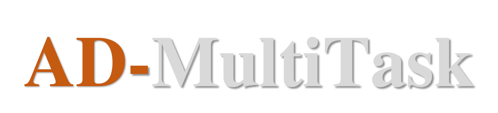

<h2 align="center">基于嵌入式域控制器平台的 AI 模型部署</h2>

[**Architecture**](./docs/framework.md)&nbsp;&nbsp;&nbsp;|&nbsp;&nbsp;&nbsp;[**Documentation**](https://liwuhen.cn/CVDeploy-2D)&nbsp;&nbsp;&nbsp;|&nbsp;&nbsp;&nbsp;[**Blog**](https://www.zhihu.com/column/c_1839603173800697856)&nbsp;&nbsp;&nbsp;|&nbsp;&nbsp;&nbsp;[**Roadmap**](./docs/roadmap.md)&nbsp;&nbsp;&nbsp;|&nbsp;&nbsp;&nbsp;[**Slack**](https://app.slack.com/client/T07U5CEEXCP/C07UKUA9TCJ)

  🌐 <b>Language</b> | 语言：
  <a href="README.md">🇺🇸 English</a>

---

本仓库主要提供 2D 与 3D 多任务网络的推理能力。它包含封装好的库，支持日常的开发、集成、测试与推理工作。该框架实现了多线程、单例模式以及生产者-消费者模型，同时还支持缓存日志分析功能。

#  Third-party Libraries

|Libraries|Eigen|Gflags|Glog|Yaml-cpp|Cuda|Cudnn|Tensorrt|Opencv|
|:-:|:-:|:-:|:-:|:-:|:-:|:-:|:-:|:-:|
|Version|3.4|2.2.2|0.6.0|0.8.0|11.4|8.4|8.4|3.4.5|

# Getting Started
Visit our documentation to learn more.
- [Installation](./docs/hpcdoc/source/getting_started/installation.md)
- [Quickstart](./docs/hpcdoc/source/getting_started/Quickstart.md)
- [Supported Models](./docs/hpcdoc/source/algorithm/Supported_Models.md)
- [Supported Object Tracking](./docs/hpcdoc/source/algorithm/Supported_Object_Tracking.md)

# Performances
- 数据集: 
    - BDD100K
        > 验证数据集为 BDD100K，其中包含 70,000 个训练样本和 10,000 个验证样本。表格中的所有模型均在完整的 BDD100K 数据集上进行了训练。
    - nuscenes
        > 验证数据集为 nuScenes-mini，表格中的所有模型均在完整的 nuScenes 数据集上进行了训练。
- 模型：部署的模型为 YOLO 多任务网络系列中的 “s” 版本。
- 量化：采用 NVIDIA 的后训练量化（Post-Training Quantization，PTQ）方法进行量化。

|Model|Platform|Resolution|mAP50-95(fp32)|mAP50(fp32)|mAP50-95(fp16)|mAP50(fp16)|mAP50-95(int8)|mAP50(int8)|
|:-:|:-:|:-:|:-:|:-:|:-:|:-:|:-:|:-:|
|[YoloP](https://drive.google.com/drive/folders/1_0YjElSSMCbeTdD2FUbJE6zIHsHhynug)|RTX4060/orin x|640x640|-|-|-|-|-|-|-|
|[A-YOLOM](https://drive.google.com/drive/folders/1_0YjElSSMCbeTdD2FUbJE6zIHsHhynug)|RTX4060/orin x|480x640|-|-|-|-|-|-|-|

#  Contributing
欢迎用户参与本项目。贡献指南请参见 CONTRIBUTING.md。我们鼓励您积极参与，贡献反馈、想法和代码。您可以加入各个工作组，工作组的大部分讨论在 Slack 或 QQ 群（938558640）中进行。

# References
- [YoloP: https://github.com/hustvl/YOLOP](https://github.com/hustvl/YOLOP)
- [A-YOLOM: https://github.com/JiayuanWang-JW/YOLOv8-multi-task](https://github.com/JiayuanWang-JW/YOLOv8-multi-task)
- [Setup Environment: https://zhuanlan.zhihu.com/p/818205320](https://zhuanlan.zhihu.com/p/818205320)
